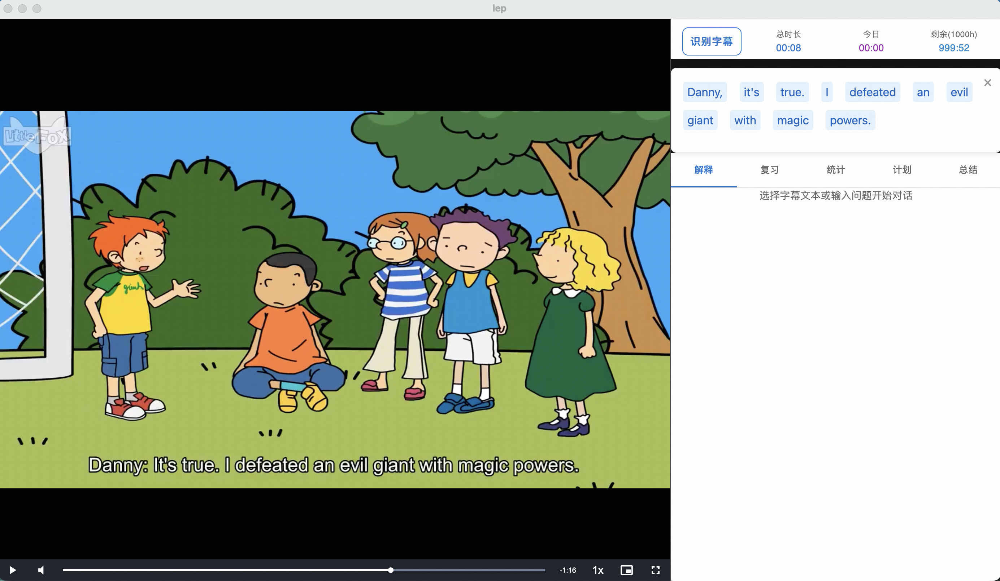

# LEP - Learn English Player

> 一款用于「看视频学英语」的桌面应用。把你喜欢的英语视频变成一套完整的学习材料：边看边查词、AI 讲解、生词收藏、间隔复习、学习计划与统计，全部在本地完成。



---

## 功能架构

```
┌─────────────────────────────────────────────────────────────────────┐
│                        LEP - 视频学习播放器                           │
├─────────────────────────────────────────────────────────────────────┤
│                                                                     │
│  ┌─────────────────────────────┐  ┌──────────────────────────────┐ │
│  │       视频播放区域            │  │        学习助手面板            │ │
│  │                             │  │                              │ │
│  │  ▶ 本地视频播放              │  │  ┌────┬────┬────┬────┬────┐ │ │
│  │  ▶ 字幕同步显示              │  │  │解释│复习│统计│计划│总结│ │ │
│  │  ▶ OCR 硬字幕识别            │  │  └────┴────┴────┴────┴────┘ │ │
│  │                             │  │                              │ │
│  │  ┌─────────────────────┐   │  │  ● AI 智能讲解（音标/释义）   │ │
│  │  │ 可点击的交互式字幕    │   │  │  ● SM-2 间隔复习翻卡         │ │
│  │  │ [Danny] [it's] [true]│   │  │  ● 学习时长/查询量统计       │ │
│  │  └─────────────────────┘   │  │  ● 每日计划与目标设定         │ │
│  │                             │  │  ● 视频学习总结导出           │ │
│  │  倍速 | 音量 | 全屏 | 进度   │  │                              │ │
│  └─────────────────────────────┘  └──────────────────────────────┘ │
│                                                                     │
├─────────────────────────────────────────────────────────────────────┤
│                          核心学习闭环                                 │
│                                                                     │
│    ┌──────┐    ┌──────┐    ┌──────┐    ┌──────┐    ┌──────┐       │
│    │      │    │      │    │      │    │      │    │      │       │
│    │ 看视频 │───▶│ 点字幕 │───▶│AI讲解│───▶│ 入库  │───▶│ 复习  │       │
│    │      │    │      │    │      │    │      │    │      │       │
│    └──────┘    └──────┘    └──────┘    └──────┘    └──┬───┘       │
│         ▲                                             │            │
│         └─────────────────────────────────────────────┘            │
│                        遗忘曲线自动安排                               │
└─────────────────────────────────────────────────────────────────────┘
```

---

## 功能介绍

### 视频播放
- 支持本地视频文件播放，常用控件齐全（播放/暂停、音量、倍速、全屏、进度跳转）。
- 自动加载与视频同名的字幕文件（`.srt` / `.vtt`）。
- 对于硬字幕（烧录在画面里的字幕）的视频，支持 **OCR 模式**：自动提取视频帧并通过视觉模型识别画面中的英文文本，让没有外挂字幕的视频也能用来学习。

### 交互式字幕
- 字幕与视频同步显示，每个单词可独立点击。
- 点击任意单词或拖选一段句子，即可发起 AI 学习查询。
- 支持「返回上一条字幕」「切换中英文」等便捷操作。

### AI 智能讲解
- 选中单词 → 自动给出 KK 音标、释义、例句、词根/词缀、近义辨析。
- 选中句子 → 给出语法结构分析、地道翻译、口语化解读。
- 流式输出，边生成边显示，支持随时打断、追问。
- 内置学习助手对话框，可就当前字幕、生词、句子继续向 AI 提问。

### 生词本与收藏
- 任何一次 AI 解释都会自动入库，无需手动添加。
- 重复查询同一单词会累计「查询次数」，帮助你识别真正的高频生词。
- 支持收藏、备注、按视频/时间筛选。

### 间隔复习 (SRS)
- 基于 SM-2 算法的间隔重复系统，自动安排每日复习队列。
- 翻卡式复习界面：先看英文，再翻面看释义，根据掌握程度评分（忘记 / 困难 / 一般 / 简单）。
- 系统据此自动调整下次复习时间，让你只在「快要忘记」时再次见到它。

### 学习计划
- 设定每日学习时长或单词数量目标。
- 系统根据生词库的复习负担与你的进度，给出当天的学习建议。

### 学习统计
- 自动记录每天的观看时长、查询次数、复习数量、掌握的生词数。
- 多维度图表帮助你看到长期进步。

### 总结回顾
- 按视频或按时间段导出学习摘要：本视频学到的生词、记下的句子、AI 给出的关键讲解。
- 适合作为「看完一部剧 / 一集播客」之后的整理素材。

---

## 安装与运行

### 环境要求
- Node.js >= 14
- npm >= 6

### 安装步骤

```bash
git clone <repo-url>
cd learn-english-player
npm install
```

创建 `.env` 文件，填入 StepFun API Key：

```
STEP_API_KEY=your_step_api_key_here
STEP_API_URL=https://api.stepfun.com/v1/chat/completions
REACT_APP_STEP_API_KEY=your_step_api_key_here
REACT_APP_STEP_API_URL=https://api.stepfun.com/v1/chat/completions
```

启动开发环境：

```bash
npm run dev
```

打包为桌面应用：

```bash
npm run build:mac    # macOS
npm run build:win    # Windows
```

---

## 使用指南

1. 启动应用后，选择本地视频文件（应用会自动查找同名 `.srt` / `.vtt` 字幕；若无外挂字幕，可启用 OCR 模式）。
2. 播放过程中，点击字幕中的单词或拖选句子，右侧「解释」面板会给出 AI 讲解。
3. 每次查询都会自动加入生词本，可在「复习」标签页进行间隔复习。
4. 在「统计」「计划」「总结」标签页查看学习进度、安排目标、回顾收获。

---

## 许可证

本项目采用 **[PolyForm Noncommercial 1.0.0](https://polyformproject.org/licenses/noncommercial/1.0.0)** 许可证：

- ✅ 允许个人学习、研究、教学、非商业性使用。
- ✅ 允许修改源码并创建衍生作品，仅限非商业用途。
- ❌ **禁止任何商业用途**，包括但不限于：销售、付费订阅、商业 SaaS、企业内部商用、广告变现、将修改版本用于商业目的等。

如需商业授权，请联系作者：**高新** (gxin0426@126.com)。详见 [LICENSE](./LICENSE)。
